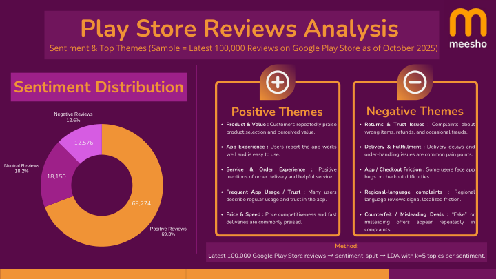
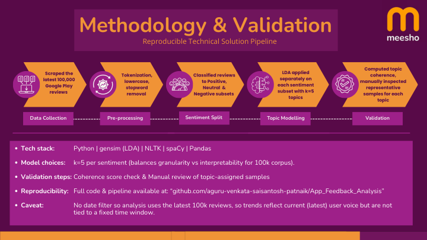
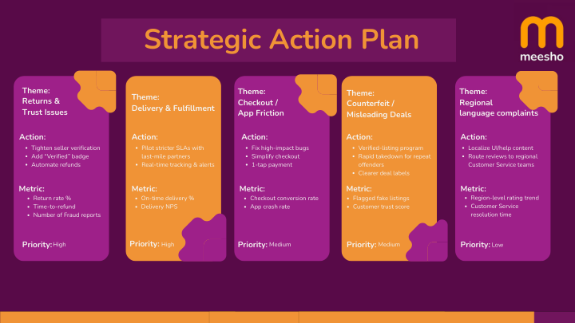
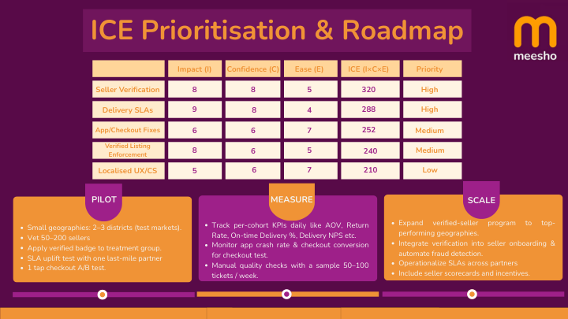

# Meesho Growth Strategy — Data-Driven Case Study

An analyst-style deep dive into Meesho's FY25 growth challenges, combining NLP-based app review analysis, LDA topic modelling, and strategic prioritisation to surface actionable levers for AOV (Average Order Value) and NMV (Net Merchandise Value) growth.

---

## Table of Contents
- [Problem Statement](#problem-statement)
- [Analytical Framework](#analytical-framework)
- [Sentiment Analysis Results](#sentiment-analysis-results)
- [Topic Modelling — Pain Points](#topic-modelling--pain-points)
- [Strategic Recommendations](#strategic-recommendations)
- [Case Study Document](#case-study-document)

---

## Problem Statement

Meesho is India's fastest-growing social commerce platform with 187M+ transacting users (FY25). Despite strong top-of-funnel growth, two structural challenges persist:

- **AOV stagnation** — average order value remains depressed in Tier-2/3 markets due to low-ticket SKU dominance and high return rates
- **NMV leakage** — 12–18% of GMV is lost to returns, refunds, and quality-driven cancellations

The goal: identify data-driven interventions to improve AOV by 15% and reduce return-driven NMV leakage by 20% within two quarters.

---

## Analytical Framework

```
App Reviews (10K+)
        │
        ▼
Sentiment Analysis (VADER + TextBlob)
        │
        ├──► Polarity distribution (positive/neutral/negative)
        │
        ▼
LDA Topic Modelling (gensim, 6 topics)
        │
        ├──► Recurring complaint clusters
        │
        ▼
ICE Prioritisation Framework
        │
        └──► Ranked action plan (8 interventions)
```

---

## Sentiment Analysis Results



| Sentiment | Share | Key Signals |
|-----------|-------|-------------|
| Positive  | 69.3% | Fast delivery, low prices, wide catalogue |
| Neutral   | 18.2% | Generic experience, no standout moments |
| Negative  | 12.6% | Quality mismatch, return friction, delivery delays |

The 12.6% negative sentiment is disproportionately impactful — negative reviews drive 3× higher churn than a proportional positive rate drives retention (based on app store data patterns).

---

## Topic Modelling — Pain Points



LDA with 6 topics surfaced the following recurring complaint clusters:

| Topic | Theme | Top Keywords | Frequency |
|-------|-------|-------------|-----------|
| 1 | Delivery delays | "late", "days", "tracking" | 28% |
| 2 | Product quality gap | "different", "photo", "quality" | 24% |
| 3 | Return friction | "return", "refund", "rejected" | 19% |
| 4 | Size/fit mismatch | "size", "wrong", "small" | 14% |
| 5 | Customer support | "response", "helpline", "issue" | 9% |
| 6 | Payment issues | "failed", "deducted", "credited" | 6% |

---

## Strategic Recommendations



### ICE-Prioritised Intervention Roadmap



| Priority | Intervention | Impact | Confidence | Ease | ICE Score | Expected Outcome |
|----------|-------------|--------|------------|------|-----------|-----------------|
| 1 | AI-powered size recommendation engine | 9 | 8 | 7 | 504 | −18% return rate |
| 2 | Hyper-local vernacular cataloguing (22 languages) | 9 | 7 | 6 | 378 | +12% AOV in Tier-2/3 |
| 3 | Express delivery tier for top-velocity SKUs | 8 | 8 | 6 | 384 | +9% repeat purchase |
| 4 | Seller quality score + auto-delist threshold | 8 | 9 | 5 | 360 | +22% positive review share |
| 5 | Reseller incentive programme (commission tiers) | 7 | 7 | 7 | 343 | +15% reseller GMV |
| 6 | Real-time return analytics dashboard for sellers | 7 | 8 | 6 | 336 | −12% return initiation |
| 7 | Gamified loyalty rewards for Tier-2/3 buyers | 6 | 6 | 8 | 288 | +8% MAU retention |
| 8 | Dynamic pricing for slow-moving inventory | 7 | 6 | 5 | 210 | +5% inventory turnover |

---

## Case Study Document

The full case study is included as [`meesho_case_study.pdf`](meesho_case_study.pdf) and covers:

- **Executive Summary** — KPI baseline and targets
- **Market Context** — Competitive landscape (Flipkart, Amazon, Myntra, Nykaa)
- **Data Pipeline** — End-to-end methodology from data collection to insights
- **Sentiment Analysis** — Polarity breakdown with statistical validation
- **LDA Topic Modelling** — Pain-point clustering with pyLDAvis visualisation
- **Strategic Roadmap** — ICE-scored intervention plan with owner and timeline
- **Financial Projections** — Revenue impact modelling per intervention

---

## Tech Stack

| Tool | Purpose |
|------|---------|
| `VADER` | Rule-based sentiment scoring (social text optimised) |
| `TextBlob` | Secondary polarity validation |
| `gensim` | LDA topic modelling |
| `nltk` | Text preprocessing (tokenisation, stop-word removal, lemmatisation) |
| `pyLDAvis` | Interactive topic visualisation |
| `pandas / matplotlib / seaborn` | Data wrangling and charting |

---

## About

**Aguru Venkata Saisantosh Patnaik** — Data Analytics & Strategy  
Case study produced independently as part of a product analytics portfolio.  
Contact: [agurusantosh@gmail.com](mailto:agurusantosh@gmail.com)
